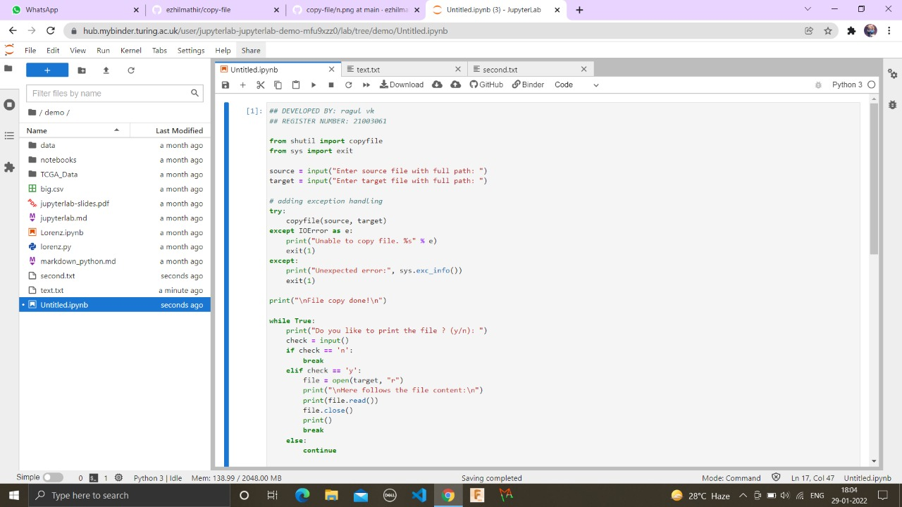
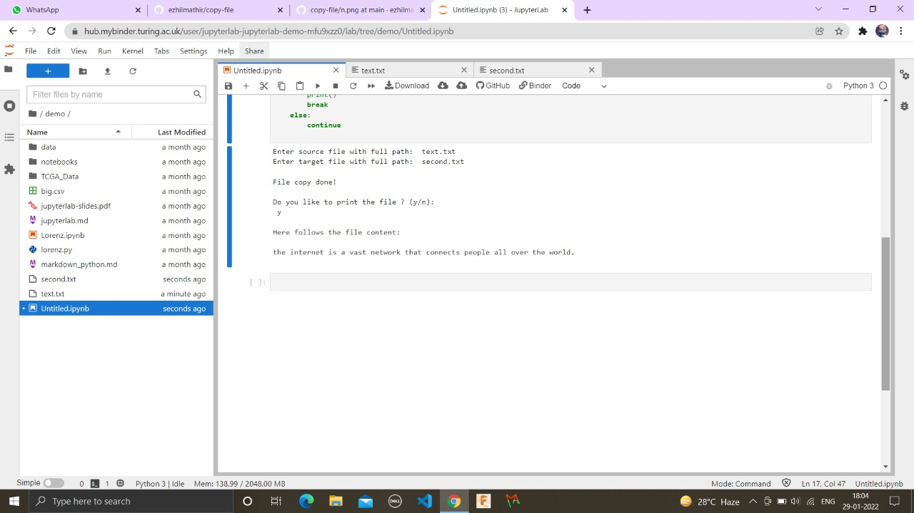

# copy-file
## AIM:
To write a python program for copying the contents from one file to another file.
## EQUIPEMENT'S REQUIRED: 
PC
Anaconda - Python 3.7
## ALGORITHM: 
### Step 1:
     From shutil import copyfile
     From sys import exit
### Step 2: 
     Take users the name of source and destination files.
 ### Step 3: 
    If the source there is a source file then copy the contents of source file to the destination file.
### Step 4:  
     Read each line from the input file and write it into the output file.
### Step 5: 
     Then print.
### Step 6: 
     End the program.
## PROGRAM:
## DEVELOPED BY: RAGUL VK
## REGISTER NUMBER: 21003061

from shutil import copyfile
from sys import exit

source = input("Enter source file with full path: ")
target = input("Enter target file with full path: ")

# adding exception handling
try:
    copyfile(source, target)
except IOError as e:
    print("Unable to copy file. %s" % e)
    exit(1)
except:
    print("Unexpected error:", sys.exc_info())
    exit(1)

print("\nFile copy done!\n")

while True:
    print("Do you like to print the file ? (y/n): ")
    check = input()
    if check == 'n':
        break
    elif check == 'y':
        file = open(target, "r")
        print("\nHere follows the file content:\n")
        print(file.read())
        file.close()
        print()
        break
    else:
        continue

### OUTPUT:

## RESULT:
Thus the program is written to copy the contents from one file to another file.